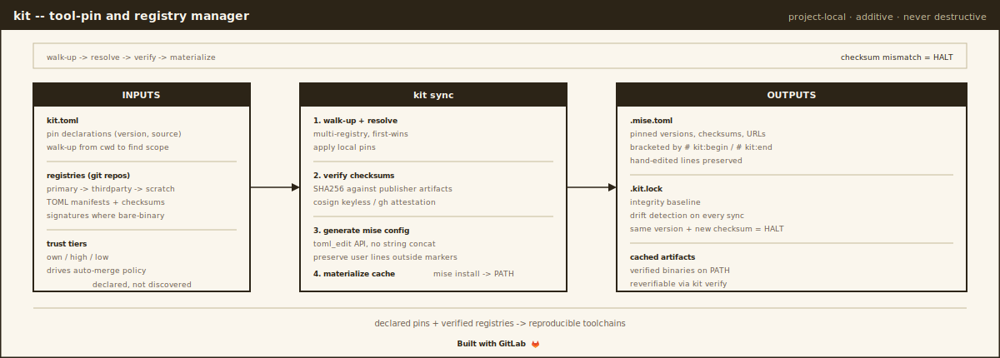
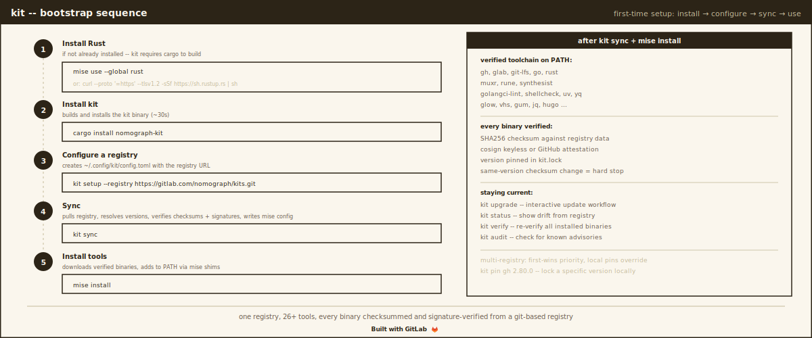

# kit

[](https://crates.io/crates/nomograph-kit)
[](https://gitlab.com/nomograph/kit/-/pipelines)
[](LICENSE)
[](https://gitlab.com/nomograph/kit)

Tool registry manager -- manages developer toolchains from git-based
registries, layered on top of [mise](https://mise.jdx.dev).

kit resolves tool versions across multiple registries, generates mise
configuration, verifies SHA-256 checksums against publisher release
artifacts, verifies cosign signatures where publishers sign bare
binaries, and automates upstream update tracking via a three-pipeline
CI architecture.

## Bootstrap



## Install

If you don't have Rust yet, the quickest path is [mise](https://mise.jdx.dev):

```bash
mise use --global rust
cargo install nomograph-kit
```

Or use rustup:

```bash
curl --proto '=https' --tlsv1.2 -sSf https://sh.rustup.rs | sh
cargo install nomograph-kit
```

The binary is called `kit`.

## Quick start

```bash
kit setup --registry https://gitlab.com/your/registry.git
kit sync
kit status
```

## Commands

| Command | Description |
|---------|-------------|
| `kit setup` | One-time config, optionally add a registry |
| `kit sync` | Pull registries, resolve, generate mise config, install |
| `kit status` | Installed vs registry, drift detection, verification strength |
| `kit diff` | Show changes between lockfile and registry |
| `kit upgrade` | Interactive tool update workflow |
| `kit verify` | Re-verify all installed binaries (checksums always; cosign only for bare-binary assets) |
| `kit audit` | Check tools for known security advisories |
| `kit add <name> <source>` | Query upstream, generate tool definition |
| `kit push <name>` | Commit and push a tool definition |
| `kit remove <name>` | Remove a tool from a writable registry |
| `kit pin <name> <version>` | Pin a tool's version locally |
| `kit unpin <name>` | Remove a local pin |
| `kit sense` | Detect upstream changes, classify by risk (CI) |
| `kit evaluate` | Rule-based + LLM review of findings (CI) |
| `kit apply` | Update TOMLs, partition by auto-merge eligibility (CI) |
| `kit verify-registry` | Validate all tool definitions before merge (CI) |
| `kit init [--ci]` | Scaffold a new registry |
| `kit completions <shell>` | Shell completions (bash/zsh/fish) |
| `kit man-page` | Generate man page |

## Registries

A registry is a git repo with per-tool TOML definitions:

```
tools/
  _meta.toml        # registry metadata + merge policy
  gh.toml           # one file per tool
  muxr.toml
  ...
```

Each tool definition is self-contained:

```toml
[tool]
name = "gh"
source = "github"
repo = "cli/cli"
version = "2.89.0"
tag_prefix = "v"
bin = "gh"
tier = "high"
aqua = "cli/cli"

[tool.assets]
macos-arm64 = "gh_{version}_macOS_arm64.zip"
linux-x64 = "gh_{version}_linux_amd64.tar.gz"

[tool.checksum]
file = "gh_{version}_checksums.txt"
format = "sha256"

[tool.signature]
method = "github-attestation"
```

Sources: `github`, `gitlab`, `npm`, `crates`, `direct`, `rustup`

Smart `kit add` queries upstream and auto-populates:

```bash
kit add jq jqlang/jq              # GitHub
kit add muxr nomograph/muxr --gitlab  # GitLab (resolves project_id)
kit add claude-code --npm @anthropic-ai/claude-code
kit add cargo-nextest --crates
```

### Trust tiers

Each tool has a tier that controls merge policy:

| Tier | Meaning | Typical policy |
|------|---------|----------------|
| own | Tools you build and publish | Auto-merge all bumps |
| high | Critical third-party tools | Manual review |
| low | Commodity tools | Auto-merge patch/minor |

Tiers are set per-tool in the TOML definition. The registry's
`_meta.toml` defines which tiers auto-merge:

```toml
[policy]
auto_merge_tiers = ["own", "low"]
auto_merge_bump = ["patch", "minor"]
auto_merge_requires_checksum = true
```

### Multi-registry

Configure multiple registries in `~/.config/kit/config.toml`. First
registry wins when tools overlap. Local pins override.

```toml
[[registry]]
name = "nomograph"
url = "https://gitlab.com/nomograph/kits.git"

[[registry]]
name = "personal"
url = "https://gitlab.com/you/kits.git"
```

Separate registries by trust boundary. For example, keep your own
tools in one registry and third-party tools in another. Each
registry has its own pipeline, merge policy, and update cadence.

### Project-local

kit discovers `kit.toml` by walking up from the working directory.
When found, tools scope to that project:

- `.kit.lock` next to `kit.toml` (committed to git)
- `.mise.toml` merged with `# kit:begin` / `# kit:end` markers
- User tools outside the markers are never touched

## CI Pipeline

kit powers a three-pipeline supply chain architecture via the
[kit-registry](https://gitlab.com/nomograph/pipeline) CI component:

```yaml
include:
  - component: gitlab.com/nomograph/pipeline/kit-registry@v3
    inputs:
      kit_version: "0.10.1"
      mr_assignee: "andunn"
```

### Sense (scheduled, read-only)

`kit sense` queries upstream releases, downloads assets, verifies
checksums, and checks advisory databases. Classifies each finding
by risk (bump level, tier, checksum status). Never fails on version
drift -- drift is what it detects.

### Evaluate (after sense)

`kit evaluate` applies deterministic rules (auto-approve clean
patches, reject checksum mismatches) and optionally invokes an LLM
for edge cases (major bumps, missing checksums, advisories).

### Apply (after evaluate)

`kit apply` updates tool TOML files on disk and partitions updates
into two groups by auto-merge eligibility:

- **auto_merge_group** -- updates eligible per registry policy
  (right tier, right bump, checksums verified)
- **review_group** -- everything else (wrong tier, major bumps,
  flagged by evaluator, unverified checksums)

The CI component creates a separate branch and MR for each group.
The auto-merge MR merges itself after the verify pipeline passes.
The review MR stays open for human review.

### Verify (on MR)

`kit verify-registry` re-validates all tool definitions and
re-verifies checksums. Runs on every MR as a merge gate.

## Security

What kit actually does on the verification path:

- **Input validation**: all fields validated against strict regex patterns
- **TOML injection prevention**: mise config built via toml_edit API
- **Same-version checksum change detection**: hard stop
- **Registry migration confirmation**: prevents silent swap between registries
- **Cosign verification**: anchored certificate identity match (bare-binary assets only; archives fall back to checksums)
- **Registry URL restriction**: https:// and git@ only
- **Symlink rejection**: malicious registries cannot escape tools/ directory
- **HTTPS-only**: all HTTP clients enforce TLS

What kit does not do: out-of-band checksum verification (checksums
are fetched from the same release as the asset), archive-content
signature verification, or human review substitution for tiers that
auto-merge.

## License

MIT -- [Nomograph](https://gitlab.com/nomograph)
